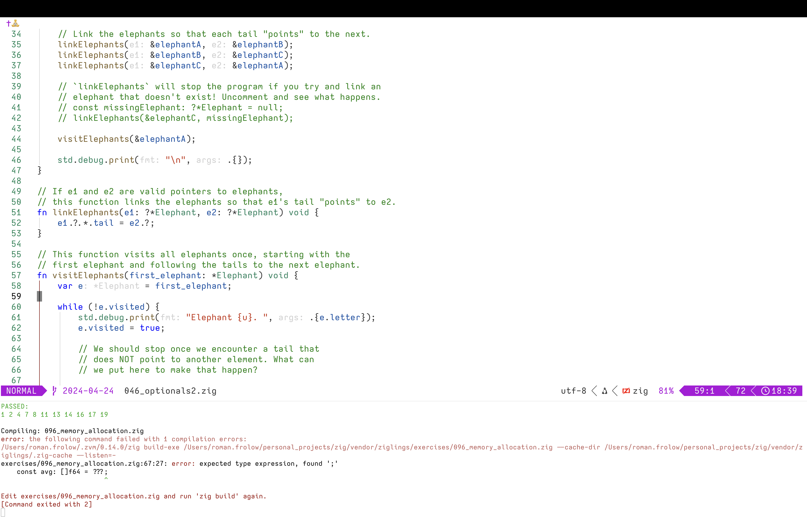

# IosevkaCustom

My custom Iosevka font.

- Shapes and width similar to [Zed Mono](https://github.com/zed-industries/zed-fonts).
- No ligatures, no italics, no bold.
- Nerd font patched.
- All icons with `--complete`.



## Run

generate `private-build-plans.toml` at https://typeof.net/Iosevka/customizer

- Overview of stylistic sets https://github.com/be5invis/Iosevka/blob/main/doc/stylistic-sets.md
  - https://news.ycombinator.com/item?id=36785409
  - https://github.com/aaronmbos/monocode/blob/main/src/private-build-plans.toml
  - https://github.com/shytikov/pragmasevka/blob/main/private-build-plans.toml
  - https://git.sr.ht/~ashton314/iosevka-output/tree/main/item/private-build-plans.toml

Requirements:

```shell
brew install ttfautohint fontforge
mkdir -p vendor && cd vendor
git clone --depth 1 https://github.com/be5invis/Iosevka.git
cd Iosevka
npm install
cd ..
curl -OJNL https://github.com/ryanoasis/nerd-fonts/releases/latest/download/FontPatcher.zip
unzip FontPatcher.zip -d FontPatcher
rm FontPatcher.zip
cd ..
```

`./reinstall.sh`
